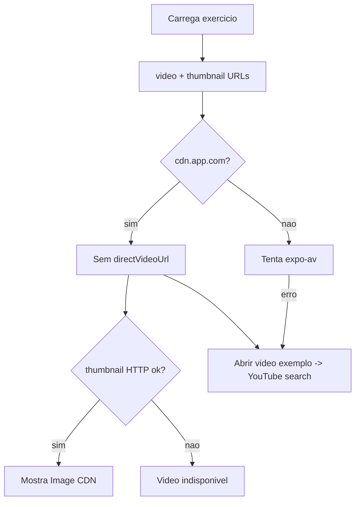

# Evolução — Auditoria de Mídia e Detalhe dos Exercícios

**Data:** 2026-06-02  
**Projeto:** `F:\projetos\evolucao app`  
**Tipo:** Inventário / análise — **sem alteração de código**  
**Relacionado:** RF-02 em [`REMAINING_FEATURES_FUNCTIONAL_QA_REPORT.md`](REMAINING_FEATURES_FUNCTIONAL_QA_REPORT.md) · revisão ampla em [`EVOLUCAO_NEXT_FEATURES_AI_NUTRITION_SOCIAL_REVIEW.md`](EVOLUCAO_NEXT_FEATURES_AI_NUTRITION_SOCIAL_REVIEW.md)  
**PASS global do app:** NÃO  

---

## 1. Veredito geral

O catálogo tem **81 exercícios** com modelo de dados consistente (`instructions`, `tips`, `commonMistakes`, `video`, `thumbnail`), mas **nenhum asset de mídia real versionado no repositório**. Todas as entradas recebem URL automática em `https://cdn.app.com/exercises/...`, tratada como **placeholder** na tela de detalhe (`isPlaceholderCdn`). Na prática o usuário vê **thumbnail CDN (frequentemente quebrada)**, **sem player nativo**, e fallback para **busca no YouTube** (“Abrir video exemplo”). O texto de execução existe em **~31 exercícios**; a maioria dos demais (~50) só tem nome, músculo e tags.

**Maior problema:** promessa visual de execução (gif/vídeo) sem mídia entregue; detalhe depende de link externo genérico.

---

## 2. Modelo atual de exercício

**Fonte:** [`src/data/exercises.js`](../../src/data/exercises.js) — `createExercise(config)`

| Campo | Origem | Notas |
|-------|--------|-------|
| `id`, `name` | config / slug | Busca por `getExerciseByName` |
| `primaryMuscle`, `secondaryMuscles` | config | Labels em `MUSCLE_GROUP_LABELS` |
| `equipment`, `objective`, `difficulty`, `tags` | config | Filtros UI |
| `instructions[]` | config | Passo a passo |
| `tips[]`, `commonMistakes[]` | config | Opcionais |
| `video` | config ou **`${CDN_BASE}/${slug}.mp4`** | CDN placeholder em 100% do catálogo |
| `thumbnail` | config ou **`${CDN_BASE}/thumbs/${slug}.png`** | CDN placeholder em 100% |
| `musclePrimary` / `muscleSecondary` | derivados | Retrocompat |

**Bridge legado:** [`src/data/exerciseLibraryV2.js`](../../src/data/exerciseLibraryV2.js) — `gif` ← `thumbnail`; fallback global `placehold.co/320x180`.

**Campos não modelados explicitamente:** `imageUrl`, `youtubeUrl`, `localAsset`, `machineSetup`, `substitutes[]`, `executionVideoId`.

---

## 3. Onde a mídia aparece no app

| Superfície | Arquivo | Comportamento |
|------------|---------|---------------|
| Catálogo / hub treinos | [`WorkoutsHubScreen.js`](../../src/screens/WorkoutsHubScreen.js) | Lista nomes; sem preview de mídia na lista principal |
| Rotinas — catálogo | [`RoutinesScreen.js`](../../src/screens/RoutinesScreen.js) | Thumb `Image` se URL; botão detalhe → `ExerciseDetail` |
| Treino do dia / sessão | [`WorkoutScreen.js`](../../src/screens/WorkoutScreen.js) | `ExerciseCard` com `gif`; botão **“Detalhes”** em sugestões (não “Ver execução”) |
| Card de série | [`src/components/workout/ExerciseCard.js`](../../src/components/workout/ExerciseCard.js) | Preview gif + texto “Preview indisponivel” on error |
| Treino livre | [`FreeWorkoutScreen.js`](../../src/screens/FreeWorkoutScreen.js) | Botão detalhe inline por exercício |
| Detalhe | [`ExerciseDetailScreen.js`](../../src/screens/ExerciseDetailScreen.js) | Tabs Resumo / Histórico / Instruções; vídeo nativo só se URL válida e **não** `cdn.app.com`; senão YouTube search no browser |
| Admin local | [`AdminScreen.js`](../../src/screens/AdminScreen.js) | Exercícios em MMKV (fora do catálogo principal) |

**Fluxo de vídeo no detalhe:**

---

## 4. Tabela por exercício (prioritários)

Legenda: **Imagem/vídeo real** = asset local ou URL não-placeholder que resolve em runtime. Hoje **todos** usam CDN `cdn.app.com` → contabilizados como **placeholder**.

| Exercício (catálogo) | Imagem real | Vídeo real | Placeholder CDN | Instruções | Dicas | Erros comuns | Músculos | Equipamento | Status |
|----------------------|-------------|------------|-----------------|------------|-------|--------------|----------|-------------|--------|
| Supino Inclinado Halter | Não | Não | Sim | 4 | 2 | 2 | Peito + ombro/tríceps | halter | Texto OK / mídia ausente |
| Supino Maquina (Chest Press) | Não | Não | Sim | 3 | 0 | 0 | Peito | máquina | Instruções básicas; sem dicas/erros |
| Voador (Peck Deck) | Não | Não | Sim | 0 | 0 | 0 | Peito | máquina | Só metadados/tags |
| Agachamento Livre | Não | Não | Sim | 4 | 3 | 3 | Pernas | barra | Texto rico / mídia ausente |
| Remada Curvada Barra | Não | Não | Sim | 0 | 0 | 0 | Costas | barra | Detalhe pobre (sem passos) |
| Rosca Direta Barra | Não | Não | Sim | 3 | 0 | 0 | Bíceps | barra | Instruções básicas |
| Desenvolvimento Halter * | Não | Não | Sim | 3 | 0 | 0 | Ombro | halter | *Substituto mais próximo de “Desenvolvimento Militar” (nome militar não existe no catálogo) |
| Leg Press 45 | Não | Não | Sim | 4 | 2 | 2 | Pernas | máquina | Texto OK / sem ajuste máquina explícito |
| Cadeira Extensora | Não | Não | Sim | 3 | 2 | 2 | Pernas | máquina | Texto OK |
| Mesa Flexora | Não | Não | Sim | 3 | 2 | 2 | Posterior | máquina | Texto OK |
| Hip Thrust * | Não | Não | Sim | 4 | 2 | 2 | Glúteo | barra | *Cobre “elevação de quadril/pélvica” com conteúdo |
| Panturrilha no Leg Press | Não | Não | Sim | 3 | 0 | 0 | Panturrilha | máquina | Instruções básicas |
| Cadeira Abdutora | Não | Não | Sim | 0 | 0 | 0 | Posterior **(primaryMuscle no catálogo)** | máquina | Metadados mínimos; ver também **Abdutora Maquina** (3 instr., dicas, erros) |

### Estatísticas do catálogo completo (script local)

| Métrica | Valor |
|---------|-------|
| Total exercícios | **81** |
| URLs vídeo `cdn.app.com` | **81** (100%) |
| Vídeo real (não-CDN) | **0** |
| Com `instructions` | **31** |
| Com `tips` | **14** |
| Com `commonMistakes` | **14** |

---

## 5. Problemas encontrados

| ID | Problema | Evidência |
|----|----------|-----------|
| EM-01 | CDN `cdn.app.com` em todo o catálogo | `createExercise` defaults L85–86 |
| EM-02 | Player nativo bloqueado para CDN | `ExerciseDetailScreen` `isPlaceholderCdn` |
| EM-03 | Fallback = busca YouTube genérica, não vídeo curado | `buildYoutubeSearchUrl` |
| EM-04 | ~50 exercícios sem passo a passo | contagem `instructions.length === 0` |
| EM-05 | Thumbnail/gif no treino quebra → “Preview indisponivel” | `ExerciseCard` |
| EM-06 | Sem botão dedicado “Ver execução” no treino ativo | só “Detalhes” em parte da UI |
| EM-07 | Sem campo “ajuste de máquina” estruturado | só texto livre em `instructions` quando existe |
| EM-08 | “Desenvolvimento Militar” ausente como nome | usar Halter/Máquina |
| EM-09 | Offline: zero assets em `assets/exercises/` | inventário repo |

---

## 6. Recomendação de UX (tela ideal por exercício)

1. **Hero:** imagem ou GIF local (loop curto), ratio 16:9, sem depender de CDN externo.
2. **CTA primário:** “Ver vídeo de execução” → modal com vídeo licenciado ou WebView YouTube **ID fixo** (não só search).
3. **Aba Instruções:** passo a passo numerado + bloco “Ajuste da máquina” quando `equipment === 'maquina'`.
4. **Blocos:** Erros comuns · Dicas · Músculos primário/secundário (chips).
5. **Treino:** tap no preview ou ícone ▶ abre o mesmo modal (sem autoplay na lista).
6. **Substituto:** link para exercício alternativo (mesmo padrão de movimento).

---

## 7. Plano de implementação sem copyright

1. Estender schema com `media: { source: 'local'|'cdn'|'youtube', thumbnail, video, youtubeId? }`.
2. **MVP:** 15–20 exercícios prioritários com PNG/GIF/WebM **próprios** em `assets/exercises/` (silhueta/ilustração interna).
3. Manter `cdn.app.com` como fallback até CDN real existir; nunca fingir que CDN resolve hoje.
4. `ExerciseDetailScreen`: se `source === 'local'`, `require()`; se `youtubeId`, abrir watch URL; senão placeholder + CTA honesto.
5. Pipeline admin (fase 2): upload via `AdminScreen` / backend, sem scrape.
6. **Não** baixar vídeos aleatórios da internet nesta fase.

---

## 8. Próxima ação única recomendada

**Corrigir fallback visual consistente** — placeholder local bonito + CTA “Ver execução” no treino e no detalhe, antes de produzir 15 vídeos reais.

**Atualização 2026-06-04:** QA visual **COMPLETO** — 4 detalhes (manual) + CTA treino (auto). Ver [`EXERCISE_MEDIA_FALLBACK_CTA_FIX_REPORT.md`](EXERCISE_MEDIA_FALLBACK_CTA_FIX_REPORT.md).

Alternativas (escolher uma por sprint):

- Preencher mídia local dos **13 prioritários** acima.
- Enriquecer texto (instruções/dicas/erros) dos que estão vazios (Peck Deck, Remada Curvada, Cadeira Abdutora, etc.).
- Melhorar `ExerciseDetailScreen` com seção “Ajuste da máquina”.

---

## CHECKPOINT — EXERCISE MEDIA AUDIT CONCLUÍDA

| Item | Valor |
|------|-------|
| emulator-5554 online? | **NÃO** (apenas `RQ8T209ZTAF`) |
| QA visual RBAC feita? | **NÃO** (bloqueada por device) |
| Relatório mídia criado? | **SIM** — este arquivo |
| Exercícios analisados | **81** catálogo + **13** prioritários em tabela |
| Quantos têm imagem real | **0** |
| Quantos têm vídeo real | **0** |
| Quantos usam placeholder | **81** (CDN `cdn.app.com` + `placehold.co` no bridge) |
| Maior problema | Mídia prometida por URL mas não entregue; detalhe cai em YouTube search |
| Próxima ação única | Fallback visual local + CTA “Ver execução” no treino |
| Código alterado? | **NÃO** |
| Commit/push feito? | **NÃO** |
| PASS global? | **NÃO** |

**Quando `emulator-5554` voltar:** rodar `tools/visual_qa_challenge_admin_rbac.ps1` antes de implementar mídia (RF-01 QA visual pendente do commit `af9acec`).
